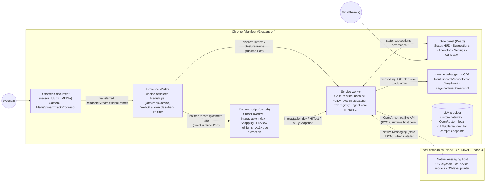
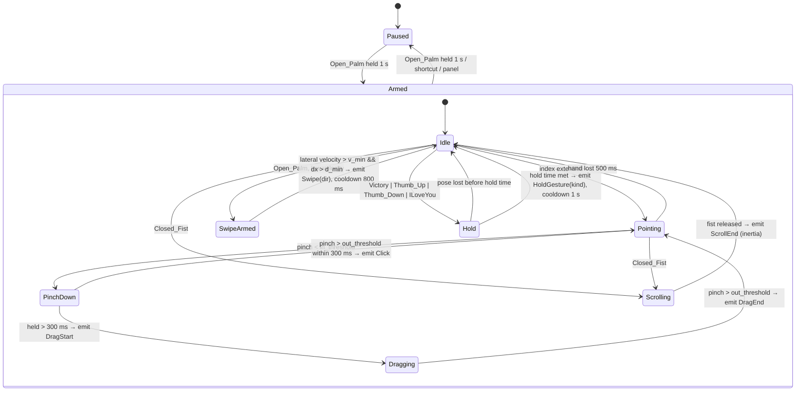
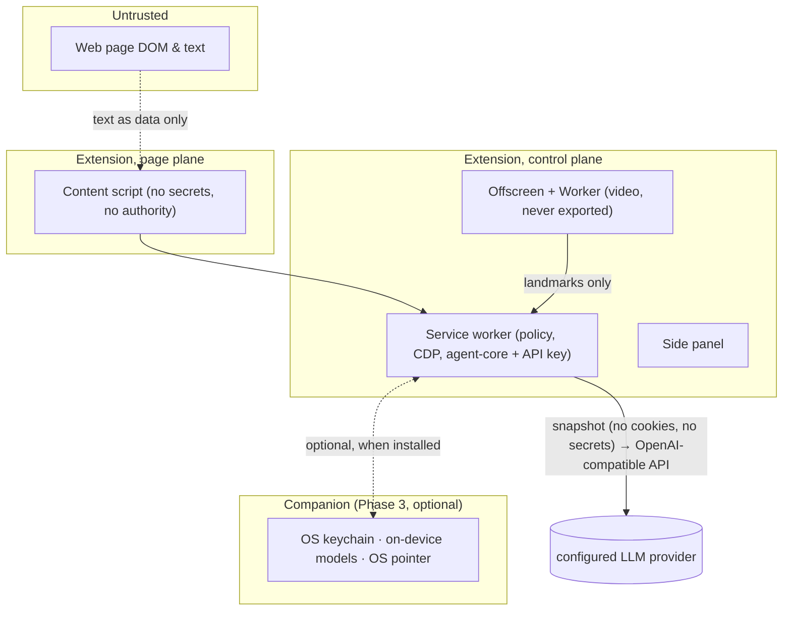

# Gesture Browser Agent — Architecture

**Status:** Draft v0.1 · **Date:** 2026-09-04

---

## 1. Architectural principles

1. **Two loops, two speeds.** A deterministic, on-device *perception–control loop* runs at camera rate (30 fps) and must never wait on the network or on a model. A slower *agent loop* runs on demand and communicates with the fast loop only through well-defined events (proposals, confirmations).
2. **Video stays in one process.** Camera frames exist only inside the extension's offscreen document. Everything downstream sees landmarks and gesture labels.
3. **The page is a hostile environment.** Content scripts hold no secrets and no authority; the service worker owns policy, and the DevTools Protocol delivers trusted input.
4. **The agent proposes, the human disposes.** Only a gesture (or keyboard) event originating in the perception pipeline can confirm a guarded action.
5. **Replaceable parts.** Recognizer, filter, state machine, action executor, and agent backend sit behind small interfaces so each can be swapped or tested in isolation.

## 2. System overview



### Why this shape

| Decision | Chosen | Rejected | Reason |
|---|---|---|---|
| Delivery form | Chrome extension | Desktop app emulating an OS mouse (Gameface style); Electron shell browser | Extension has the DOM, so it can snap to targets and describe the page to the agent; users keep their own browser, logins, and extensions. Desktop-level control is a later companion, not the core. |
| Camera host | Offscreen document with `USER_MEDIA` reason | Side panel (unreliable `getUserMedia`), popup (dies on blur), content script (per-tab permission prompts, leaks video into page context), dedicated pinned tab (works, but ugly) | One long-lived hidden document owns the camera for the whole browser session; pinned tab kept as fallback. |
| Inference location | In a **Worker inside the offscreen document** (WASM-SIMD + WebGL); frames arrive via `MediaStreamTrackProcessor` → transferred `ReadableStream`, not `requestVideoFrameCallback` | Native companion with Python MediaPipe; MediaPipe on the offscreen document's own thread | A hidden offscreen document never fires `rAF`/`rVFC` and its timers align to 1 Hz, so the frame pump must be camera-driven in a Worker (04-feasibility A1). No WebGPU delegate exists in tasks-vision (A3). Native inference stays an option behind the same `GestureFrame` interface. |
| Input dispatch | **Hybrid**: content-script synthetic events by default, CDP via `chrome.debugger` only in trusted-click mode or for targets needing user activation | CDP-primary; content-script only | The debugger infobar is unavoidable and forces manual Web Store review, so CDP is opt-in, not the default (04-feasibility B1). Phase 0 G5 measures the fraction of sites where synthetic clicks fail. `debugger` is an optional permission. |
| Agent placement | **Agent loop in the service worker** (`agent-core`, OpenAI-compatible tool loop, BYOK) | Local companion process via native messaging; hosted backend; Claude Agent SDK | Anthropic prohibits subscription login in third-party apps and the Agent SDK bundles a ~200 MB binary (04-feasibility A4). BYOK keeps the key in the service worker with a disclosure. A companion re-enters in Phase 3 only for an OS keychain, on-device models, or OS-level pointer; a hosted backend is a later paid tier behind the same message protocol. |
| Agent perception | Accessibility tree + interactable index first, screenshot on demand | Screenshot-only (computer-use style) | Tree is cheap, deterministic, and maps 1:1 to the snapping targets the user already sees; screenshots are added for canvas/visual layouts. |

## 3. Components

### 3.1 Offscreen document — perception pipeline

Responsibilities: camera capture, hand landmark + gesture inference, pointer derivation, smoothing, framing into `GestureFrame`.

The offscreen document acquires the camera; a dedicated **Worker** owns inference. A hidden offscreen document cannot drive a frame pump (`rAF`/`rVFC` never fire, timers align to 1 Hz — 04-feasibility A1), so frames are pushed by the camera, not pulled by visibility:

```
offscreen doc:
  getUserMedia(640×480, 30fps)
  → new MediaStreamTrackProcessor({ track })
  → transfer processor.readable (ReadableStream<VideoFrame>) to the Worker

inference Worker (OffscreenCanvas):
  for await (const frame of readable):
    → HandLandmarker.detectForVideo(frame, ts)          // MediaPipe tasks-vision, VIDEO mode, 1 hand; GestureRecognizer only as interim reference
    → frame.close()
    → Landmark normalizer (translate to wrist, scale by palm size, mirror if selfie)
    → 1€ filter on landmarks 0, 4, 8, 9 (tasks output is unsmoothed) and on the pointer
    → Own classifier (MLP/kNN over normalized landmarks, mandatory "none" class, palm-facing gate, 3-frame vote, score ≥ 0.6)
    → Derived features: pinch distance (4↔8) / dist(0,9), finger extension flags, wrist velocity, hand bbox scale
    → Pointer = landmark 8 (index tip) mapped from calibrated active box → viewport [0,1]²
    → GestureFrame { ts, present, handedness, gesture, score, pinch, features, pointer, raw landmarks? }
    → runtime.Port: PointerUpdate direct to the content script (@camera rate); discrete Intents / GestureFrame to the service worker
```

Notes:
- Delegate selection at startup: **WebGL → WASM-SIMD CPU** (no WebGPU — it does not exist in tasks-vision, 04-feasibility A3), decided by a timed first inference (init > 5 s or per-frame > 40 ms → CPU); result cached.
- `webglcontextlost` recovery: recreate the recognizer on context loss (blocklisted GPUs and SwiftShader deprecation mean context creation can fail outright); feature-detect WebGL2 → WASM fallback.
- Adaptive frame rate: drop to 15 fps when no hand has been seen for 5 s (saves CPU); resume at 30 fps on detection.
- Model bundle: `hand_landmarker.task`. The own classifier is trained in-browser from fixtures (retires Model Maker); custom per-user gestures use the same path (Phase 3 UI).
- Transfer the `ReadableStream`, not the `MediaStreamTrack` (transferable tracks are unmaintained in Chrome). Landmarks are omitted from the port payload in steady state (structured clone) unless recording.

### 3.2 Service worker — control plane

Responsibilities: gesture state machine, policy, mapping gestures to actions, tab registry, debugger lifecycle, agent messaging, settings.

- **Gesture state machine** (XState): consumes `GestureFrame`s, emits `Intent`s. States: `Paused`, `Armed.Idle`, `Armed.Pointing`, `Armed.PinchDown`, `Armed.Dragging`, `Armed.Scrolling`, `Armed.SwipeArmed`, `Armed.HoldGesture(kind)`, `Agent.Proposing`, `Agent.AwaitingConfirm`. Hold timers, cooldowns, and hysteresis live here, not in the recognizer. Event-sourced: every transition is logged for diagnostics and replay tests.
- **Action mapper**: `Intent × Profile → Action`. Profiles: Accessibility, Standard, Presenter; user overrides stored in `chrome.storage.sync`.
- **Action dispatcher**: executes `Action`s. `click`/`drag`/`key` default to **content-script synthetic events**; CDP `Input.*` is used only in trusted-click mode or when the target needs user activation (attaches per gesture session, detaches on pause). `scroll` → content-script `scrollBy` with inertia (or CDP `Input.dispatchMouseEvent(type=mouseWheel)` in trusted mode); `history.back/forward`, `tabs.*`, `zoom` → chrome APIs. Pointer moves do not pass through the service worker: the inference Worker streams `PointerUpdate` to the content script directly.
- **Tab registry**: tracks active tab, iframe frames, and whether the content script is alive; re-injects on SPA route change if needed.
- **Policy engine**: site allow/deny for agent; guarded-action classification; kill switch fan-out.
- **Keep-alive and state**: the service worker is **stateless** — session state lives in `chrome.storage.session`, reconnecting on `onDisconnect`. MV3 workers idle out after 30 s; the open runtime Port from the offscreen document (carrying discrete intents) resets the timer while tracking is armed, and `chrome.alarms` handles reconnection. Ports are not treated as an indefinite keep-alive.

### 3.3 Content script — page plane

Injected into every frame (`all_frames: true`, `document_start`), isolated world, Shadow DOM overlay.

- **Cursor overlay**: a `<div>` in a closed shadow root at `z-index: 2147483647`, `pointer-events: none`, `aria-hidden`. States rendered as shape/colour: idle, pointing, hover-snapped, pinch, drag, paused. Position updates via `transform: translate3d` on `requestAnimationFrame`, interpolating between 30 fps updates for 60/120 Hz displays.
- **Interactable index**: maintains a spatial index (grid buckets) of actionable elements: `a[href]`, `button`, `input`, `select`, `textarea`, `[role=button|link|tab|menuitem|checkbox|option]`, `[tabindex>=0]`, `[onclick]`, `video` controls, plus heuristics for large clickable cards. Rebuilt on `MutationObserver` (debounced), scroll, and resize; visibility-filtered with `elementFromPoint` checks on the candidates.
- **Snapping**: given pointer `(x,y)` and radius `r` (default 48 CSS px, scaled by pointer speed: no snap while moving fast), pick the nearest visible interactable by distance to its bounding box; hysteresis prevents flicker between neighbours; returns element id and centre for the click dispatch.
- **Preview highlights**: draws a ring around the element the agent intends to act on, with the action label.
- **A11y snapshot**: builds a compact accessibility-tree-like JSON of visible interactables (`id, role, name, value, bbox, state`) for the agent; ids are stable per page load and shared with the snapping index so "click element 17" is unambiguous.
- **Fallback input**: synthetic `pointerdown/mousedown/mouseup/click` sequence and `focus()` when CDP is unavailable.

### 3.4 Side panel — human interface

React app in `chrome.sidePanel`. Shows tracking status, camera preview toggle (landmark skeleton only, not raw video, by default), calibration wizard, gesture map editor, profiles, agent suggestions, agent step log with cancel, safety policy display, diagnostics. Also hosts the microphone for voice input in Phase 2 (side panel is a visible, user-opened surface, which is the right place for mic permission).

**Camera/mic grant page** (`grant-camera.html`, full tab). `getUserMedia` fails with `NotAllowedError` in the offscreen, popup, and side-panel pages unless the `chrome-extension://<id>` origin already holds a persistent grant, and Chrome's "Allow this time" grant is revoked on tab close (04-feasibility A2). Onboarding therefore opens a full-tab extension page via `chrome.tabs.create`, requests camera (and mic, Phase 2) there, and instructs the user to pick "Allow on every visit". Before every offscreen start the extension checks `navigator.permissions.query({name:'camera'})` and routes back to this page if it is not `granted`.

### 3.5 Agent plane — in the service worker (Phase 2)

The agent loop runs **inside the service worker** via the `agent-core` package; there is no local companion in the MVP (04-feasibility A4). Anthropic prohibits subscription login in third-party apps and the Agent SDK bundles a ~200 MB binary, so the design is BYOK against any OpenAI-compatible endpoint.

- **Agent runtime**: own `agent-core` tool loop over the OpenAI-compatible Chat Completions API with a custom tool set mirroring the extension's action surface (`observe_page`, `click`, `type`, `scroll`, `navigate`, `select_tab`, `propose`, `request_confirmation`). Each tool call is executed by the service worker's dispatcher and reports back the observed result, giving the model a closed loop. No vendor SDK; any endpoint that speaks `/v1/chat/completions` with tools works.
- **Provider config**: `{ baseURL, apiKey, models: { fast, planner }, preset? }`, set by the user in the side panel. A setup-time capability probe records whether the endpoint supports tool calling, streaming, and `response_format: json_schema`; missing features switch on fallbacks (JSON-in-text parsing, non-streamed responses).
- **Model routing**: `fast` for suggestions and single steps (latency), `planner` for multi-step task planning; both are just model ids on the configured endpoint.
- **Injection guard**: page text is wrapped in a delimiter block labelled as untrusted; hidden/zero-size/off-screen nodes and HTML comments are stripped at extraction; a regex/small-classifier pass looks for imperative instructions to the assistant; positives force a `request_confirmation`.
- **Guarded action classifier**: rule-based (URL patterns, button text, form field types `password`, `cc-number`, `email` submit) plus model self-report; marks actions that require thumbs-up.
- **Secrets**: the API key lives in the service worker only (`chrome.storage.session`, optional persist to `local` after a plain disclosure that extension storage is not an OS keychain — 04-feasibility B7), never in a content script, and is sent only to the configured `baseURL`.
- **Optional companion (Phase 3)**: a Node native-messaging host re-enters only to provide an OS keychain, on-device speech/vision models, or an OS-level pointer. It has no CDP access; all actions still execute in the service worker. Protocol: newline-delimited JSON over stdio (`observe`, `propose`, `run_task`, `confirm`, `cancel`, `status`).

## 4. Data flow

### 4.1 Direct control: pinch to click

```mermaid
sequenceDiagram
  participant Cam as Webcam
  participant Off as Offscreen (MediaPipe)
  participant SW as Service worker (FSM)
  participant CS as Content script
  participant CDP as chrome.debugger
  Cam->>Off: frame (33 ms cadence)
  Off->>Off: landmarks → features → 1€ filter
  Off->>SW: GestureFrame{pointer, pinch=0.9, gesture=None}
  SW->>CS: PointerUpdate{x,y}
  CS->>CS: snap to nearest interactable (id 17, "Sign in" button)
  CS-->>SW: HoverTarget{id:17, bbox}
  Off->>SW: GestureFrame{pinch=0.18}  (below pinch-in threshold)
  SW->>SW: Pointing → PinchDown (start 300 ms timer)
  Off->>SW: GestureFrame{pinch=0.45}  (above pinch-out threshold, < 300 ms)
  SW->>SW: PinchDown → Click intent
  SW->>CDP: Input.dispatchMouseEvent(pressed/released at bbox centre)
  CDP-->>SW: ok
  SW->>CS: Feedback{click at 17}
  CS->>CS: ripple animation on cursor
```

Budget: 33 ms (frame) + ~12 ms (inference, GPU) + ~2 ms (filter+port) + ~1 ms (snap) + ~5 ms (CDP round trip) ≈ 55 ms from frame capture to click, well inside the 150 ms target once the hold/hysteresis time is excluded.

### 4.2 Agent assist: Victory → suggestions → thumbs up

```mermaid
sequenceDiagram
  participant Off as Offscreen
  participant SW as Service worker
  participant CS as Content script
  participant SP as Side panel
  participant Co as Agent runtime (agent-core)
  Off->>SW: Victory held 500 ms
  SW->>CS: RequestA11ySnapshot
  CS-->>SW: A11ySnapshot (≈2–6 KB JSON)
  SW->>Co: observe{url, title, snapshot, screenshot?: no}
  Co->>Co: LLM (fast model): propose 3–5 actions with element ids
  Co-->>SW: propose[{id:"open-pricing", action:click(23), label:"Open Pricing", guarded:false}, ...]
  SW->>SP: show suggestions
  SW->>CS: highlight candidates
  Off->>SW: Thumb_Up held 700–800 ms
  SW->>SW: AwaitingConfirm → Execute top suggestion
  SW->>Co: critic(action object, metadata only — no page text)
  Co-->>SW: allow / needs-confirm
  SW->>CS: Preview{23, "Open Pricing"} (≥ 400 ms)
  SW->>SW: dispatch click (content-script default; CDP in trusted mode)
  SW->>Co: result{ok, newUrl}
```

**Propose-only is the default mode**: the agent surfaces suggestions and does not execute until the user opts into execute mode for the session. Before any *write* action a **metadata-only critic** call (`fast` model) sees the proposed action object — never page text — and can force a confirmation. The preview UI renders target, origin, and value from the action object, never from model text.

### 4.3 Guarded action

Same as 4.2, but the guarded-action classifier marks `guarded:true` (for example a "Place order" button). The service worker enters `Agent.AwaitingConfirm` with a 15 s timeout; only a `Thumb_Up` hold from the perception pipeline (or the keyboard confirm shortcut) transitions to execute. `Thumb_Down`, `Open_Palm` (pause), timeout, or panel Cancel abort and notify the agent loop.

## 5. Gesture state machine (core)



Rules encoded in the machine, not the recognizer:
- Stable-tracking gate: no gesture fires until the hand has been tracked stably for ≥ 300 ms, so transient poses on hand entry cannot trigger an action.
- Confidence gating: a gesture label must exceed its score threshold for 3 consecutive frames to count.
- Cooldown after any discrete action prevents double fire.
- Pinch hysteresis: in at `0.25 × dist(0,9)`, out at `0.35 × dist(0,9)` (defaults, calibrated per user); release plus 80–120 ms debounce.
- Dwell-click: pointer held within a small radius over a snapped target for the dwell time (default 600 ms) emits a click — an MVP click mode alongside pinch, default in the Accessibility profile.
- Pointer freeze during pinch: pointer position is latched at pinch-in (~150 ms) so the click lands where the user aimed.

## 6. Interfaces (TypeScript sketches)

```ts
// Perception → Control
interface GestureFrame {
  ts: number;                      // performance.now() in offscreen doc
  present: boolean;
  handedness?: 'Left' | 'Right';
  gesture?: 'None'|'Closed_Fist'|'Open_Palm'|'Pointing_Up'|'Thumb_Down'|'Thumb_Up'|'Victory'|'ILoveYou'|string;
  score: number;
  pinch: number;                   // thumb–index distance / palm width
  fingers: [boolean, boolean, boolean, boolean, boolean]; // extended flags
  velocity: { vx: number; vy: number }; // wrist, normalized units / s
  scale: number;                   // hand bbox height, proxy for distance
  pointer: { x: number; y: number }; // filtered, [0,1] viewport space
  landmarks?: Float32Array;        // 21×3, only when recording
}

// Control → Page
type PageCommand =
  | { type: 'pointer'; x: number; y: number; state: CursorState }
  | { type: 'highlight'; ids: number[]; label?: string }
  | { type: 'preview'; id: number; label: string }
  | { type: 'snapshot' }
  | { type: 'fallbackClick'; id: number };

// Page → Control
type PageEvent =
  | { type: 'hover'; id: number | null; bbox?: DOMRectReadOnly }
  | { type: 'snapshot'; items: A11yItem[] }
  | { type: 'ready'; frameId: number };

interface A11yItem { id: number; role: string; name: string; value?: string; bbox: [number,number,number,number]; state?: string[] }

// Control ↔ Companion
type CompanionMsg =
  | { t: 'observe'; url: string; title: string; items: A11yItem[]; screenshotPng?: string }
  | { t: 'run_task'; goal: string }
  | { t: 'confirm'; proposalId: string } | { t: 'cancel' }
  | { t: 'result'; proposalId: string; ok: boolean; observation?: unknown };
type CompanionEvt =
  | { t: 'propose'; proposals: Proposal[] }
  | { t: 'step'; text: string }
  | { t: 'need_confirm'; proposal: Proposal; reason: string }
  | { t: 'done' | 'error'; text: string };
interface Proposal { id: string; label: string; action: Action; guarded: boolean }
```

## 7. Security and privacy boundaries



- Permissions requested: `offscreen`, `sidePanel`, `storage`, `tabs`, `scripting`; `debugger` (**optional** permission, requested on first need); `nativeMessaging` (**optional**, Phase 3); host permission `<all_urls>` for the content script (explained in onboarding). The LLM endpoint host is not known at build time, so it is requested at runtime via `optional_host_permissions` (`https://*/*`, granted only for the configured `baseURL` origin).
- The debugger banner is mitigated by using CDP only in trusted-click mode and detaching on pause.
- No frame, landmark, or screenshot is persisted unless the user records custom gestures (landmarks only) or opts into diagnostics.
- Companion binds to stdio only; no local HTTP server, so no cross-origin exposure.

## 8. Performance plan

| Stage | Target | Technique |
|---|---|---|
| Inference | ≤ 15 ms/frame WebGL, ≤ 40 ms WASM-SIMD | WebGL delegate (no WebGPU); 1 hand max; capture 640×480 (input resolution barely affects inference — models resize internally); adaptive fps when idle; cold GPU init up to 30 s, warm at install |
| Offscreen → SW | ≤ 1 ms | Port messaging, no landmarks in steady state |
| SW → CS pointer | ≤ 2 ms | Port per tab; coalesce to one message per frame |
| Cursor render | 60–120 Hz | rAF interpolation; `transform` only; `will-change` |
| Snapping | ≤ 1 ms | Spatial grid over precomputed bboxes; recompute on mutation debounced 100 ms |
| CDP click | ≤ 10 ms | Debugger pre-attached while armed |
| Agent suggestion | ≤ 3 s p50 | `fast` model tier (Haiku/Flash/small-open-weight class); snapshot capped at 150 items; no screenshot unless tree is sparse |

## 9. Testing strategy

- **Recognizer fixtures**: recorded landmark sequences (JSON) for each gesture across 10+ people, lighting, and distances; replayed through features + FSM in Vitest; assertions on emitted intents and no false fires. This is the regression suite for every threshold change.
- **FSM model tests**: XState model-based testing to enumerate paths and cooldown invariants.
- **Extension e2e**: Playwright launching Chromium with the unpacked extension; fake webcam via `--use-fake-device-for-media-stream --use-file-for-fake-video-capture=<y4m>` with recorded gesture videos; assert clicks land on a test page.
- **Snapping tests**: DOM fixtures with dense/overlapping targets; property tests on hysteresis.
- **Agent red team**: pages with embedded injection attempts; assert no guarded action executes without a `confirm` message originating from the FSM.
- **Performance CI**: fps and per-stage timing on a reference machine, tracked over time.

## 10. Repository layout (proposed)

```
human-gesture/
  apps/
    extension/            # WXT project (MV3)
      entrypoints/
        offscreen/        # camera capture + MediaStreamTrackProcessor
        offscreen/inference.worker.ts  # MediaPipe (OffscreenCanvas, WebGL), classifier, 1€ filter
        background.ts     # service worker: FSM, dispatcher, policy, agent-core (Phase 2)
        content/          # overlay, index, snapping
        sidepanel/        # React UI
        grant-camera/     # full-tab camera/mic permission page
      public/models/      # hand_landmarker.task, wasm
    companion/            # Node native-messaging host (Phase 3, optional: OS keychain, local models)
    playground/           # Phase-0 web page for tuning and demos
  packages/
    gesture-core/         # features, 1€ filter, FSM, types (pure TS, no DOM)
    page-index/           # interactable index + snapping (DOM, testable in jsdom/happy-dom)
    protocol/             # shared message types + zod schemas
  fixtures/gestures/      # recorded landmark sequences and y4m videos
  docs/
```

## 11. Alternatives kept in reserve

- **Native inference companion** (Python/Rust with MediaPipe or a newer hand model) behind the same `GestureFrame` interface if browser inference proves too slow on low-end Windows laptops.
- **OS-level pointer mode** (companion drives the OS cursor via `enigo`/`pyautogui`) for users who want gestures outside Chrome.
- **Hosted agent backend** for a paid tier: same `CompanionMsg` protocol over WebSocket with account auth.
- **Head/face gestures** (MediaPipe Face Landmarker blendshapes, Gameface-style) as an alternative clutch/confirm channel for users without hand mobility.
- **WebMCP tool consumption** when sites expose structured tools; reduces token use and brittleness of DOM actions.
