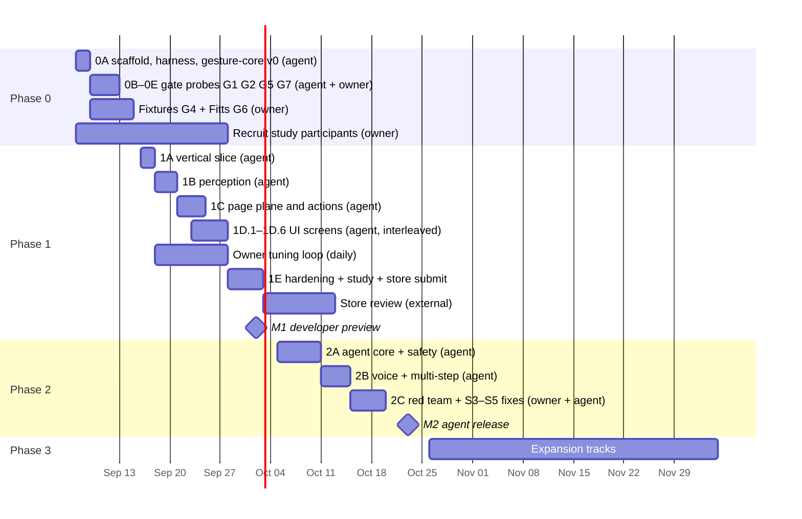

# Gesture Browser Agent — Roadmap

**Status:** Draft v0.3 · **Date:** 2026-09-04 · **Inputs:** 01-prd.md, 02-architecture.md, 03-tech-stack.md, 04-feasibility.md
**Delivery model:** one human (owner) directing Claude Code; no other engineers.

This roadmap supersedes the phase table in 01-prd.md §11 and incorporates the design changes required by 04-feasibility.md (worker frame pump, full-tab camera grant, WebGL-only delegate, BYOK agent in the service worker, dwell-click in MVP, presenter persona deferred).

v0.3 restructures each phase into **milestones**. A milestone is the unit of architectural planning: one plan (CLAUDE.md §1 form) per milestone, written only when every input the plan depends on is already recorded in the decision log (§8). Release milestones keep their names: **M1** developer preview, **M2** agent release.

---

## 1. Estimation model

Estimates are for a coding agent, not a team. Three kinds of work have very different clocks:

| Kind | Unit | Typical size | What bounds it |
|---|---|---|---|
| **Agent work** | agent-session: one focused Claude Code session on a scoped task, ending with tests passing and a human review | 1–3 hours wall clock | Spec clarity, test harness quality, review bandwidth of the owner |
| **Owner work** | owner-hour | as stated | Only a human can hold a hand in front of a webcam, feel latency, judge fatigue, recruit participants, sign installers |
| **External wait** | calendar days | as stated | Web Store review, participant scheduling, shipping a Windows laptop, Anthropic key setup |

Rules used below:

- Code that can be verified without a camera (pure TS, FSM, snapping, protocol, agent loop) is cheap: 1–2 sessions per component. The agent verifies against fixtures, happy-dom, and Playwright with a fake webcam.
- Code whose correctness is only observable through a live camera (filter tuning, thresholds, cursor feel) costs the same to write but each iteration needs the owner at the laptop. Budget owner-hours, not sessions.
- The agent cannot run on the 2020 Intel Air or the Windows Xe laptop. Owner runs the bench harness there; the agent reads the CSV.
- Recruiting and running participants is the single longest item in the whole plan. Start it in Phase 0, not Phase 1.
- Assume 4–6 agent-sessions per owner-day when the owner is available full time, 2–3 when part time. Calendar figures below assume roughly half-time owner availability.

**Headline:** M1 (developer preview) in about 4 calendar weeks, M2 (agent release) in about 7–8 calendar weeks, versus 21 weeks in the team-based plan. Almost all of the remaining calendar time is owner testing, participant studies, and store review.

---

## 2. Milestones and planning rules

### 2.1 What a milestone is

| Rule | Meaning |
|---|---|
| **One milestone, one plan** | Each milestone below gets exactly one architectural plan in CLAUDE.md §1 form (placement, boundary check, interfaces touched, principle check, tests). Sessions inside the milestone still run the §1 checklist, but they do not re-open placement or interface decisions made in the milestone plan. |
| **Plan only when inputs exist** | Every milestone lists its *plan inputs*: gate results or §8 decisions. The plan is not written until all of them are logged. Planning ahead of an input means re-planning later. |
| **Interfaces are decided at the earliest milestone that crosses them** | Any `protocol` schema shared by two milestones is fixed in the first one. Later milestones extend a schema; they do not redefine it. |
| **Thresholds are not plan material** | Filter constants, hold times, snap radius, fps targets change through the fixture replay suite, never by re-opening a plan. A milestone plan names the parameter and its test; the value comes from tuning. |
| **A milestone ends at a gate, not a date** | The exit condition is a test, a measurement, or a §8 entry. Calendar figures in §2.3 are for scheduling owner time, not for judging completion. |
| **Change of ownership needs an ADR** | If a milestone plan moves responsibility between components (offscreen, service worker, content script, side panel, companion), the plan is an ADR draft under CLAUDE.md §3 and the owner decides before any code. |

### 2.2 Why phases are split the way they are

| Phase | Milestones | Reason for the split |
|---|---|---|
| 0 | **0A** scaffold + harness + `gesture-core` v0, then **0B–0E** one per gate probe | 0A items share layout, package boundaries, fixture format and the first `protocol` schemas, so they need one coherent plan. The gate probes are independent spikes with their own verification and no shared interface. |
| 1 | **1A** vertical slice, **1B** perception, **1C** page plane and actions, **1D.1–1D.6** one per UI screen, **1E** hardening | 1B needs G1, G3, G4; 1C needs G5, G6. Those results arrive at different times, so 1B and 1C cannot share a plan. But `GestureFrame`, `Intent`, `PageCommand`, `PageEvent` and FSM state names cross both, so 1A fixes them first through one gesture end to end. UI screens are planned one at a time because the owner writes the intent per screen (§7). |
| 2 | **2A** agent core + safety, **2B** voice and multi-step, **2C** fixes | Safety cannot be added after the agent loop exists: tool surface, `Agent.*` FSM states, guarded-action gate and propose-only default are one design under "agent proposes, human disposes". 2B is separable and depends on live latency numbers from 2A. |
| 3 | one milestone per track, planned only when the track starts | Tracks are independent, have their own gates, and two of them (3.3, 3.4) change component ownership and therefore need ADR-level plans. |

### 2.3 Phase map

| Phase | Window | Milestones (plans) | Agent sessions | Owner hours | External wait | Exit gate (summary) |
|---|---|---|---|---|---|---|
| **0 — Foundations & spike** | Sep 7 → Sep 15 | 5 | 12–16 | 14–18 | Laptop access | Tier A items resolved in code; G1–G8 measured; go/no-go logged |
| **1 — MVP direct control** | Sep 16 → Oct 2 | 10 (1A, 1B, 1C, 1D.1–1D.6, 1E) | 28–36 | 24–30 | Participants, store review (5–14 days, overlaps Phase 2) | 5 testers complete S1 and S2 unaided; NFR table met; store submitted |
| **2 — Agent assist** | Oct 5 → Oct 23 | 3 | 24–30 | 16–20 | API key, 3 returning participants | S3, S4, S5 pass; zero unconfirmed guarded actions in red team |
| **3 — Expansion** | Oct 26 → ongoing | 1 per track | per track | per track | per track | per track |

Phase boundaries are gates, not dates. 1A may start while G4 and G6 are still being collected, because those gates set thresholds, not architecture.

---

## 3. Phase 0 — Foundations & spike (≈ 1.5 weeks)

**Goal.** Resolve every "blocks Phase 0 as written" finding in code, stand up the repository with a verification harness the agent can use without a camera, and turn the eight feasibility gates into measurements.

### 3.1 Milestone 0A — Docs, scaffold, harness, `gesture-core` v0

| | |
|---|---|
| **Plan inputs** | 01–04 docs as amended by 04-feasibility §4. No gate results needed. |
| **Plan scope** | Repo layout per 02-architecture §10; package boundaries and lint rules; fixture JSON format; first `protocol` schemas (`GestureFrame` v0, landmark fixture record); `gesture-core` public API; bench CSV columns. |
| **Interfaces fixed here** | Fixture record shape, `GestureFrame` v0, bench CSV schema. These are consumed by 0B, 0D, 1A. |
| **Sessions** | 6–8 |
| **Exit** | `pnpm build`, `pnpm test` green from a clean clone; fixture round-trip test; bench harness runs headless on a placeholder y4m. |

| # | Task | Sessions | Verification the agent can do alone |
|---|---|---|---|
| 0.1 | Apply 04-feasibility §4 edits to 01, 02, 03 | 1 | Diff review by owner |
| 0.2 | Monorepo per 02-architecture §10: pnpm, Turborepo, WXT with React, `gesture-core`, `page-index`, `protocol`, `playground`, `fixtures` | 1–2 | `pnpm build`, `pnpm test` green from clean clone |
| 0.3 | `CLAUDE.md` for the repo: commands, package boundaries, "video never leaves the worker", fixture-first testing rule, one-milestone-one-plan | 0.5 | — |
| 0.4 | CI: lint, Vitest, Playwright with `--use-fake-device-for-media-stream --use-file-for-fake-video-capture`, extension zip | 1 | CI green on a placeholder y4m |
| 0.5 | Bench harness in `playground`: per-stage timers, fps, delegate switch, `GestureRecognizer` vs `HandLandmarker`, 480p/720p, CSV export | 1–2 | Runs headless against a y4m fixture |
| 0.6 | Fixture recorder and player: normalized landmarks + label + metadata to JSON; replay through `gesture-core` | 1 | Round-trip test |
| 0.11 | `gesture-core` v0: 1€ filter, landmark normalizer, pinch feature by dist(0,9), FSM skeleton, classifier interface with a kNN placeholder | 2 | Unit tests; replay of whatever fixtures exist |
| 0.12 | `docs/spike-results.md` template and go/no-go decision record | 0.5 | — |

### 3.2 Milestones 0B–0E — Gate probes

Each probe is an independent spike with its own short plan. They share nothing except the fixture format and bench CSV from 0A, so they may run in any order and interleave with owner work.

| Milestone | Gate | Task | Plan inputs | Sessions | Agent verification | Exit |
|---|---|---|---|---|---|---|
| **0B** | G1 | Frame pump: offscreen doc → `MediaStreamTrackProcessor` → transferred stream → Worker → MediaPipe on `OffscreenCanvas`; fps logger | 0A | 2 | Playwright, fake camera, doc hidden, asserts ≥ 28 fps for 60 s | Owner's 10-minute run logged in `spike-results.md` |
| **0C** | G2 | Camera grant page + `permissions.query` pre-check + "Allow this time" detection | 0A | 1 | Playwright with pre-granted permissions | Owner's Chrome-restart check logged |
| **0D** | G5 | Click-dispatch survey script: 20 site fixtures (local clones plus live list), synthetic vs CDP, records outcome | 0A | 1–2 | Runs in Playwright | Owner spot-check done; dispatch default entered in §8 |
| **0E** | G7 | Agent latency probe: `fast` and `planner` models on the chosen OpenAI-compatible endpoint (reference Haiku 4.5 / Sonnet 5), 150-item snapshot, streamed structured output, p50/p95; also probes tool-calling and `json_schema` support | 0A, owner's API key | 1 | Runs with owner's key; agent reads the numbers | p50/p95 logged; provider and model ids entered in §8 |

### 3.3 Owner work (14–18 hours)

| Gate | What only the owner can do | Hours |
|---|---|---|
| G1 | 10-minute hidden-doc run on the M1 | 0.5 |
| G2 | Grant flow, restart Chrome, verify no prompt; test "Allow this time" | 0.5 |
| G3 | Run bench harness on M1 Air, 2020 Intel Air, 11th-gen Xe Windows; copy CSVs into `fixtures/bench/` | 3 |
| G4 | Record 5 people × gestures × 3 distances × 2 palm orientations, plus 30 min "none" motion each. Start with self on day 1 so the agent can train the classifier early; add the other four across the phase | 8–10 |
| G5 | Spot-check 5 of the 20 live sites where the script reports failure | 1 |
| G6 | Fitts task: snapping vs raw, pinch vs dwell, supported vs not, Borg CR10; owner as first participant, then 2 more | 2 |
| G8 | Read `spike-results.md`, sign the go/no-go | 0.5 |

Recruiting for the Phase 1 study starts on day 1 of Phase 0; it takes 2–3 weeks and is off the critical path only if it starts now.

### 3.4 Exit criteria

- G1–G7 recorded in `docs/spike-results.md`; G8 decision logged in §8 of this doc.
- Delegate order, click-dispatch default, click-mode default, and hold times committed as numbers in 03-tech-stack §4.
- `gesture-core` replay suite passes on the owner's own fixture set; the four other recordings can land during 1B.
- Clean clone to running playground in under 10 minutes, verified by the owner on a second machine.

---

## 4. Phase 1 — MVP direct control (≈ 2.5 weeks to submit)

**Goal.** A Chrome extension that Maya can use to read, scroll, follow links, go back, and switch tabs for 15 minutes without mouse or keyboard.

**In scope.** FR-1 to FR-6, FR-8, FR-10 to FR-16, FR-30 to FR-32. Six gestures at launch: palm clutch, index point, pinch tap and hold, dwell-click, fist scroll, palm swipe left/right (off in Accessibility profile), Victory reserved for a placeholder panel.

**Out of scope.** Agent, voice, gesture-training UI, presenter mode, tab swipes by default.

### 4.1 Milestone 1A — Vertical slice (3–4 sessions)

The golden path from CLAUDE.md §4: one gesture end to end, gesture → FSM → action → test. Everything later imitates this slice.

| | |
|---|---|
| **Plan inputs** | G1 (frame pump path), G5 (dispatch default), G8 go. G3, G4, G6 are **not** required. |
| **Plan scope** | Final `protocol` schemas `GestureFrame`, `Intent`, `PageCommand`, `PageEvent`; FSM state names `Paused`, `Armed.*` and the transition log shape; Port topology offscreen → content script and offscreen → service worker; dispatcher skeleton in `background.ts`. |
| **Interfaces fixed here** | All four schemas above and the FSM state tree. 1B, 1C, 1D, 2A extend them; none redefines them. |
| **Gesture chosen** | Palm clutch to arm, fist scroll to act. Needs no classifier beyond the kNN placeholder and no snapping. |
| **Sessions** | 3–4: offscreen → content-script direct Port with `GestureFrame` (1); minimal FSM `Paused` → `Armed` → scroll intent with replay test (1); dispatcher scroll via the G5 default path plus service-worker `storage.session` (1); Playwright e2e on a fake camera y4m (0–1) |
| **Exit** | Fixture replay produces the expected `Intent` sequence; Playwright with a fake camera scrolls a test page; boundary lint passes on all three components. |

### 4.2 Milestone 1B — Perception pipeline (6–8 sessions)

`entrypoints/offscreen`, `gesture-core`.

| | |
|---|---|
| **Plan inputs** | 1A merged; G3 (delegate order, fps per laptop); G4 (launch gesture set, owner's fixtures at minimum). |
| **Plan scope** | Worker lifecycle and delegate fallback; classifier architecture and training script; feature set and filter placement; adaptive fps policy. Extends `GestureFrame` with classifier output fields. |
| **Exit** | Precision/recall table on held-out fixtures meets the G4 target; replay suite in CI fails loudly on threshold change; 30/15 fps adaptation verified in Playwright. |

| Task | Sessions | Agent verification |
|---|---|---|
| Offscreen lifecycle: single instance via `getContexts`, permission pre-check, restart on stream end | 1 | Playwright |
| Worker: `HandLandmarker`, WebGL → WASM by timed first inference, `webglcontextlost` recovery, adaptive 30/15 fps | 2 | Playwright with fake camera; context-loss simulated via `WEBGL_lose_context` |
| Own classifier: MLP or kNN over wrist-centred scale-normalized landmarks, mandatory "none" class, palm-facing gate, 3-frame vote; training script from fixtures | 2 | Precision/recall on held-out fixtures printed as a table |
| Features and filtering: pinch, finger flags, wrist velocity, scale; 1€ on landmarks 0, 4, 8, 9 and pointer | 1 | Jitter and lag metrics on replayed fixtures |
| Replay suite in CI, threshold changes fail loudly | 1 | CI |

### 4.3 Milestone 1C — Page plane and actions (8–10 sessions)

`page-index`, `entrypoints/content`, `background.ts`.

| | |
|---|---|
| **Plan inputs** | 1A merged; G5 (dispatch default, CDP opt-in shape); G6 (pinch vs dwell default, snapping on/off, initial snap radius). |
| **Plan scope** | Interactable index and its id scheme (shared later with the a11y snapshot in 2A); snapping algorithm and hysteresis parameters as named tunables; full FSM with hold timers and cooldowns; dispatcher paths, CDP attach/detach policy, scroll inertia, tabs, zoom, back/forward. Extends `PageCommand` and `Intent`. |
| **Exit** | Fitts page in Playwright meets the 4.6 targets for acquisition time and click precision; XState model tests pass; Playwright kills the service worker and asserts recovery. |

| Task | Sessions | Agent verification |
|---|---|---|
| Cursor overlay: closed shadow root, rAF interpolation, five states, `aria-hidden`, high-contrast | 1 | happy-dom + Playwright screenshots |
| Interactable index: grid hash, `MutationObserver` 100 ms debounce, visibility filter, iframe geometry | 2 | DOM fixtures with dense and overlapping targets |
| Snapping: speed-scaled radius, neighbour hysteresis, pointer latch at pinch onset, dwell ring | 1–2 | Property tests on hysteresis; Fitts page in Playwright |
| XState FSM: full `Armed.*` tree, hold timers, cooldowns, 300 ms stable-tracking gate, transition log | 2 | XState model-based tests; fixture replay asserts intents and no false fires |
| Dispatcher: G5 default, CDP trusted-click behind optional `debugger`, attach per session, detach on pause; scroll inertia; back/forward; tabs; zoom | 2 | Playwright test page counts trusted vs synthetic clicks |
| Service worker hardening: port reconnect, SPA re-injection | 1 | Playwright kills the SW and asserts recovery |

### 4.4 Milestones 1D.1–1D.6 — Onboarding, calibration, settings, diagnostics (8–10 sessions)

`entrypoints/sidepanel`, `grant-camera.html`. One milestone per screen. The plan input for each is the owner's two- or three-sentence intent for that screen (§7) plus the tunables it exposes from 1B and 1C. Screens may be planned in any order once their inputs exist; 1D.5 should land before the owner tuning loop starts, because it produces the numbers the loop needs.

| Milestone | Screen | Plan inputs | Sessions |
|---|---|---|---|
| **1D.5** | Diagnostics: fps, stage timings, dropped frames, false-positive log, JSON export | 1A; owner intent | 1 |
| **1D.1** | First-run: full-tab camera grant, GPU warm-up, posture guidance, 60-second tutorial | 0C grant page; owner intent | 2 |
| **1D.2** | Calibration: active box, pinch thresholds, filter slider, gain, click mode, handedness, mirror | 1B and 1C tunable names; owner intent | 2 |
| **1D.3** | Settings: camera picker, gesture map editor, profiles, trusted-click toggle, snap radius, shortcut and toolbar pause | 1B gesture set; 1C dispatcher options; owner intent | 2 |
| **1D.4** | HUD with live-region announcements, "move closer" cue, optional audio | 1C FSM transition log; owner intent | 1 |
| **1D.6** | Cheat sheet, store listing copy, permission justifications, privacy disclosure | 1D.1–1D.5 done | 1 |

Exit for each: Playwright screenshot reviewed by the owner; settings round-trip through `chrome.storage` validated by the `protocol` schema.

### 4.5 Milestone 1E — Hardening (2–4 sessions)

| | |
|---|---|
| **Plan inputs** | 1B and 1C merged; owner's y4m gesture recordings; Phase 0 bench numbers for the regression thresholds. |
| **Plan scope** | e2e wiring, perf CI thresholds, study-fix intake. No new interfaces. |
| **Exit** | 4.6 table met; store submitted. |

| Task | Sessions |
|---|---|
| Playwright e2e on recorded y4m gesture videos (owner records them; agent wires them) | 1–2 |
| Perf CI with regression thresholds from Phase 0 bench | 1 |
| Fixes from the study | as needed |

### 4.6 Owner work (24–30 hours)

| Activity | Hours | Notes |
|---|---|---|
| Daily tuning loop with the live camera: filter feel, pinch thresholds, dwell time, snap radius. Report numbers from diagnostics, not impressions, so the agent can act on them | 8–10 | Roughly 1 hour per day from 1B onward; needs 1D.5 first |
| Record 6–8 short y4m gesture videos for e2e | 1 | Once thresholds settle |
| Cross-laptop check on Intel Air and Xe Windows at the end of 1C | 2 | Bench CSV plus subjective feel |
| Accessibility study: 5 participants, S1 and S2 unaided, Borg every 5 min, diagnostics export | 8–10 | 1.5 hours per participant including setup; remote sessions are acceptable if the participant installs the unpacked extension |
| Bias check on new participants with the fixture protocol | in study | — |
| Web Store account, submission, respond to review | 2 | Expect manual review because of `<all_urls>` and optional `debugger` |

### 4.7 Exit criteria

| Criterion | Target | Source |
|---|---|---|
| Testers completing S1 and S2 unaided | 5 of 5 | Study |
| Sustained session without fatigue stop | ≥ 15 min for 4 of 5, Borg ≤ 3 supported | Study |
| Target acquisition, 40 px, snapping | ≤ 1.8 s median | Fitts page |
| Click precision with snapping | ≥ 95 % | Fitts page |
| False discrete actions | < 1 per 10 min | Diagnostics |
| Inference fps | ≥ 30 Apple Silicon / Xe, ≥ 20 Intel Air | Perf CI + diagnostics |
| CPU and memory | ≤ 25 % of one core, ≤ 400 MB | Diagnostics |
| Recovery after hand re-enters | ≤ 500 ms | Fixture replay |
| Store submission | Submitted | — |

Milestone **M1 — Developer preview** is the submission date; the store review (5–14 days) overlaps Phase 2.

---

## 5. Phase 2 — Agent assist (≈ 3 weeks)

**Goal.** Victory opens a panel of context-aware suggestions; thumbs up executes; guarded actions never run without a camera-originated confirmation; voice fills text fields.

**Architecture.** No local companion. Agent loop in the service worker via the own `agent-core` package speaking the OpenAI-compatible Chat Completions API (tools, streaming, `json_schema`) to a user-configured provider (`baseURL`, key, `fast` / `planner` model ids), host permission requested at runtime for the configured origin, key confined to the service worker with a plain disclosure that extension storage is not a keychain.

**In scope.** FR-20 to FR-26 (voice as on-device Web Speech), FR-33 opt-in counters.

### 5.1 Milestone 2A — Agent core and safety (16–20 sessions)

One plan for both, because the safety design decides the shape of the agent loop: which tool calls exist, where the guarded-action gate sits in the dispatcher, how `confirm` can only originate in the FSM, and what the panel may show before a confirm.

| | |
|---|---|
| **Plan inputs** | M1 submitted; G7 (provider, model ids, p50/p95, tool-calling and `json_schema` support); 1C interactable id scheme. |
| **Plan scope** | `agent-core` package boundary and public API; tool surface and its Zod schemas in `protocol`; a11y snapshot shape and id sharing with snapping; FSM `Agent.Proposing` and `Agent.AwaitingConfirm`; guarded-action gate placement in `background.ts`; propose-only default; preview from the action object; injection guard; domain policy; kill-switch fan-out; key storage and disclosure. |
| **Interfaces fixed here** | `Proposal`, `Action`, the tool schemas, `Agent.*` FSM states, `CompanionMsg`/`CompanionEvt` equivalents for the in-worker loop. 2B extends them. |
| **Decisions entered in §8 by this plan** | Propose-only vs execute default (provisional; confirmed by 2C red team). |
| **Exit** | Red-team CI suite asserts zero guarded executions without an FSM `confirm`; Playwright with a mocked agent renders suggestions; recorded API responses replay in tests; first suggestion p50 from the live G7 harness ≤ 3 s. |

**Agent core**

| Task | Sessions | Agent verification |
|---|---|---|
| A11y snapshot: strip hidden, zero-size, off-screen nodes and comments; ids shared with snapping; cap 150; optional CDP screenshot when tree is sparse | 2 | Snapshot golden files on DOM fixtures |
| Tool surface and Zod schemas in `protocol`: `observe_page`, `click`, `type`, `scroll`, `navigate`, `select_tab`, `propose`, `request_confirmation` | 1 | Schema tests |
| Suggestion call: `fast` model, `effort: low`, streamed structured output, cached prefix, first suggestion rendered on arrival | 2 | Recorded API responses replayed in tests; live p50 from G7 harness |
| Panel: Victory 600 ms → 3–5 suggestions with highlights; thumbs up 700–800 ms with progress ring; pinch to pick; thumbs down dismisses | 2 | Playwright with mocked agent |
| FSM `Agent.Proposing` and `Agent.AwaitingConfirm`, 15 s timeout, kill-switch fan-out | 1 | Model-based tests |
| Onboarding step: key entry, spend-limit advice, agent on/off | 1 | — |

**Safety**

| Task | Sessions | Agent verification |
|---|---|---|
| Propose-only default; execute mode opt-in per session | 1 | FSM tests |
| Guarded-action classifier: URL patterns, button text, `password`, `cc-number`, email-submit; model self-report as a second vote | 2 | Labelled fixture set of 100 actions |
| Metadata-only critic (`fast` model) on the action object before any write | 1 | Recorded responses |
| Preview from the action object, never model text, ≥ 400 ms | 1 | Playwright |
| Injection guard: untrusted delimiters, imperative heuristic, positives force confirmation | 1 | Red-team fixture pages |
| Domain policy: default deny for financial, health, government; per-site override; shown in panel | 1 | Unit tests |
| Red-team suite in CI: injection pages, lookalike buttons, off-screen forms, iframes imitating the panel; asserts zero guarded executions without an FSM `confirm` | 2 | CI |

### 5.2 Milestone 2B — Voice and multi-step tasks (6–8 sessions)

| | |
|---|---|
| **Plan inputs** | 2A merged; live suggestion latency from the owner's daily walk-through; `planner` model p50/p95 from G7; Chrome version floor for `processLocally`. |
| **Plan scope** | Mic grant on the full-tab page; Web Speech placement in the side panel; dictation as an FSM sub-state of `Armed`; multi-step plan representation as a list of `Action` objects narrated per step; encrypted profile storage and the "fill, never submit" rule as a dispatcher guard; telemetry counters. Extends `Proposal` for multi-step plans. |
| **Exit** | Dictation round-trip in Playwright with a mocked recognizer; multi-step plan cancels at any step in FSM tests; form fill never emits a submit `Action` in the red-team suite. |

| Task | Sessions |
|---|---|
| Mic grant on the full-tab page; Web Speech in side panel with `processLocally: true` on Chrome 139+, cloud fallback behind consent | 2 |
| Pinch-and-hold in a field starts dictation, release commits, thumbs down clears, optional agent clean-up | 1 |
| Multi-step goals: `planner` model for cross-page plans, `fast` model for steps, step narration, cancel at any step | 2 |
| Local encrypted profile for form fill; agent fills, never submits | 1 |
| Opt-in telemetry counters and cost/latency logging | 1 |

### 5.3 Milestone 2C — Fixes from red team and S3–S5 (2 sessions, as needed)

| | |
|---|---|
| **Plan inputs** | Owner's manual red-team log; S3–S5 results. |
| **Plan scope** | No new interfaces. Every red-team finding becomes a CI case before its fix merges. Confirms or reverses the propose-only default in §8. |
| **Exit** | 5.5 criteria met. |

### 5.4 Owner work (16–20 hours)

| Activity | Hours |
|---|---|
| Create a key on the chosen provider, set spend limit, run G7 harness against the real pipeline | 1 |
| Daily walk-through of suggestions on 10 everyday sites; log bad suggestions and latency | 6 |
| Manual red team: try to make the agent act without a thumbs up; try injection pages the CI suite does not have | 4 |
| Voice testing on macOS (open Chrome bug on on-device recognition) and Windows | 2 |
| S3, S4, S5 with 3 returning participants | 4–5 |
| Store update with new permissions justified | 1 |

### 5.5 Exit criteria

- S3, S4, S5 pass with 3 of 3 participants.
- Zero guarded actions executed without an FSM-originated confirmation across the CI red-team suite and the owner's manual pass.
- First suggestion visible ≤ 3 s p50, ≤ 6 s p95.
- Cost per suggestion and per 10-step task documented in the onboarding spend guidance.
- Suggestion acceptance ≥ 40 % over the first two weeks of preview telemetry (measured after M2, not a blocker).

Milestone **M2 — Agent release**.

---

## 6. Phase 3 — Expansion (from late October 2026)

Independent tracks with their own gates, in order of value to the primary persona. Each track is one milestone with one plan, written when the track is picked up and its dependency has shipped. Tracks marked **ADR** move responsibility between components and are planned as ADR drafts under CLAUDE.md §3.

| Track | Scope | Plan inputs | Sessions | Owner | Gate |
|---|---|---|---|---|---|
| **3.1 Per-user gesture training UI** | Record 10–20 samples, retrain in-extension classifier, remap | M1; 1B classifier API | 4–6 | 3 h | New gesture ≥ 95 % precision for its trainer within 20 samples |
| **3.2 Head and face gestures** | Face Landmarker blendshapes as clutch and confirm for users without hand mobility | M1; 0B frame pump numbers with a second model loaded | 6–8 | 8 h incl. 3 participants | 3 participants without hand mobility complete S1 |
| **3.3 Hosted tier** (ADR) | Backend under project key issuing short-lived tokens; accounts; settings sync | M2; two weeks of cost telemetry | 10–14 | 6 h + hosting setup | Long-lived key never reaches client; pricing decided |
| **3.4 Local companion** (ADR) | Native messaging host: OS keychain, on-device speech and vision, optional OS pointer | M2; 2B voice results | 8–10 | 6 h + signing certs, notarization wait | Installer notarized on macOS, signed on Windows |
| **3.5 Presenter mode (Priya)** | Pose-based for 1.5–3 m: body landmarks, large poses, dwell | 3.4 or stronger browser model | 8–10 | 6 h at 2 m with a TV | Reliable clutch and dwell at 2 m on 720p |
| **3.6 WebMCP** | Use site tools before DOM actions; interim MAIN-world mirror of `registerTool` | M2; Chrome consumer API stable | 4–6 | 2 h | Works on two reference sites |
| **3.7 Firefox** | Different capture host, content-script-only dispatch | M1; G5 result | 8–12 | 4 h | S1 and S2 pass on Firefox |
| **3.8 Two-hand and OS-level control** | Only if 3.4 exists and users ask | 3.4 | — | — | — |

---

## 7. Working with Claude Code on this repo

Conventions that keep agent sessions short and verifiable. They belong in `CLAUDE.md` and are listed here so the plan and the repo agree.

- **One milestone, one plan.** The architectural plan (CLAUDE.md §1) is written once per milestone in §3–§6, after its plan inputs are in §8. Sessions inside the milestone do not re-open placement or interface decisions; if one has to, the milestone is re-planned explicitly and the reason goes into §8.
- **Fixture-first.** No threshold or filter change merges without the replay suite. The agent cannot see the camera; recorded landmarks are its eyes.
- **Numbers, not adjectives.** When the owner reports a problem from live testing, attach a diagnostics export. "Cursor feels laggy" becomes "p95 pointer lag 140 ms at min_cutoff 1.0". The agent acts on the second form.
- **One session, one component.** Each row in the tables above is a session-sized task with a named verification. Do not merge rows.
- **Fake camera in every e2e test.** Playwright always launches with the fake-device flags and a y4m from `fixtures/`. Real-camera checks are owner work and are listed as such.
- **Trust boundaries are lint rules.** A test fails if `VideoFrame` or `ImageBitmap` types appear outside the offscreen worker, if the API key is referenced outside `background.ts`, or if a content script imports from the agent package.
- **Spec before code for anything with a UI.** The owner writes two or three sentences of intent per screen; the agent produces the screen and a Playwright screenshot for review. Each screen is its own milestone (1D.1–1D.6).
- **State, not history, at session start.** `docs/STATUS.md` is the one-page index every session reads first; it never grows. A session edits only its workstream row there and the `## Status` of its `docs/plans/<milestone>.md`. Per-component boundaries live in `.claude/rules/` (path-scoped, auto-loaded), history in `docs/journal/YYYY-MM-DD-<milestone>.md`. Parallel sessions use separate worktrees, one milestone each; subagents never write state files. See `CLAUDE.md §0`.
- **Decision log is in this file.** Every gate result and default chosen goes into §8 with a date, so later sessions do not re-derive it. A milestone plan may not start until its inputs are there.

---

## 8. Decision log

| Date | Decision | Input | Result |
|---|---|---|---|
| 2026-09-04 | Estimation model: coding agent plus one owner, no team | Owner | This document v0.2 |
| 2026-09-04 | Planning unit is the milestone; one plan per milestone, gated on plan inputs; Phase 1 split into 1A–1E with a vertical slice first; Phase 2 plans agent core and safety together | Owner review of v0.2 | This document v0.3 |
| 2026-09-05 | **G2 (0C) camera grant = GO.** Full-tab grant page → persistent camera grant the offscreen doc inherits across a Chrome restart with no prompt; `background.ts` `permissions.query` pre-check gates every offscreen start and routes to the grant page when not granted; "Allow this time" detected (`persistent:false`), not mistaken for persistent. Finding: MV3 service worker can answer `permissions.query({name:'camera'})`. Consumed by 1D.1 onboarding. | G2 (0C): E2 Playwright (pre-granted) + E1 owner restart/"Allow this time" | Recorded in `spike-results.md §G2` |
| 2026-09-05 | **Click-dispatch default = CDP** (trusted `Input.dispatchMouseEvent`); *synthetic-first + CDP-escalation* is the noted alternative. 1C's CDP dispatcher must target the element bounding box with scroll-into-view (§G5 caveat), not raw coordinates. | G5 (0D): E3 Playwright survey (synthetic 10/15, CDP 14/15; CDP rescues 4) + E1 owner spot-check 2026-09-05 | Recorded in `spike-results.md §G5`; unblocks 1A, 1C; number to `03-tech-stack §4` |
| — | Click mode default for Accessibility profile (pinch vs dwell) | G6 | pending; unblocks 1C |
| — | Browser inference vs ONNX-Web on Intel Air | G3, G8 | pending; unblocks 1B |
| — | Launch gesture set (which six) | G4 | pending; unblocks 1B |
| — | Hold times as fixed defaults | G4, G6 | pending; tunable, does not block a plan |
| — | Provider, `fast` / `planner` model ids, `json_schema` support | G7 (0E) | pending; unblocks 2A |
| — | Public developer preview vs invite-only | Store review | pending |
| — | Propose-only vs execute as default agent mode | 2A plan (provisional), 2C red team (final) | pending |
| — | Hosted tier: build or defer | Phase 2 telemetry, cost | pending; unblocks 3.3 |

---

## 9. Top risks and re-plan triggers

A trigger that fires re-opens only the milestone named in the response, not the phase.

| Phase | Risk | Trigger | Response |
|---|---|---|---|
| 0 | Worker frame pump under 28 fps in a hidden doc | G1 fails | Pinned camera tab becomes primary; re-plan 0B, 1 extra session |
| 0 | Intel Air under 20 fps on every path | G3 fails | ONNX-Web path into 1B (4–6 sessions); or relax Intel Air to 15 fps dwell-only |
| 0 | Participant recruiting slips | Fewer than 5 confirmed by Sep 21 | Run study with 3, finish with 2 more before M1 goes public |
| 1 | Owner tuning loop becomes the bottleneck | More than 3 open "feel" issues without diagnostics numbers | Add the missing metric to diagnostics (1D.5) first, then tune |
| 1 | False activations above 1 per 10 min in study | 1E study | Cut to 4 gestures; raise hold times; retrain "none" class with study data. Thresholds only; no re-plan |
| 1 | Store review rejects `<all_urls>` plus `debugger` | Review feedback | Ship content-script-only build; CDP as separate opt-in flow. Re-plan 1D.3 only |
| 2 | First suggestion over 3 s p50 | 2A live probe | Snapshot cap 80; `fast` model only; prefetch snapshot on Victory onset. Parameters inside 2A, no re-plan |
| 2 | Red team finds an unconfirmed guarded action | 2C | Release blocked until fixed; case added to CI suite; if the hole is structural, re-plan 2A as an ADR |
| 3 | Chrome adds idle-closing for offscreen documents | Release notes | Pinned tab fallback already tested; promote it |

---

## 10. What changed versus 01-prd.md §11

| PRD §11 | This roadmap | Why |
|---|---|---|
| 2 + 6–8 + 8 weeks with a team | ~1.5 + 2.5 + 3 weeks with one owner directing Claude Code; critical path is owner testing and participants | Delivery model |
| Phases as the planning unit | Milestones as the planning unit, each gated on logged inputs; vertical slice before widening | Agent workflow; avoids re-planning when gate results land mid-phase |
| Phase 0: standalone page | Eight measured gates plus a fixture-first harness so the agent can verify without a camera | Feasibility Tier A; agent workflow |
| Phase 1: 6–8 weeks | Dwell-click, own classifier with "none" class, hybrid dispatch, full-tab camera grant | 04-feasibility A1, A2, A3, B1, B4, B5 |
| Phase 2: local companion with Claude Agent SDK | Agent loop in the service worker, BYOK, own OpenAI-compatible tool loop against any provider; `fast` tier for ranking | A4, B6 |
| Presenter in Phase 1 scenarios | Phase 3 track 3.5, pose-based | B2 |
| Custom gestures via Model Maker in Phase 3 | Classifier in Phase 1 core; only the training UI in Phase 3 | B4 |
| Voice via Web Speech or Whisper | On-device Web Speech (Chrome 139+) first | Tier C |
